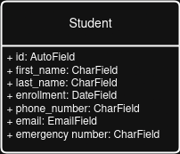
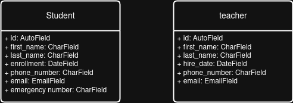
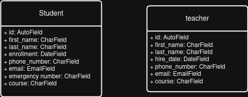
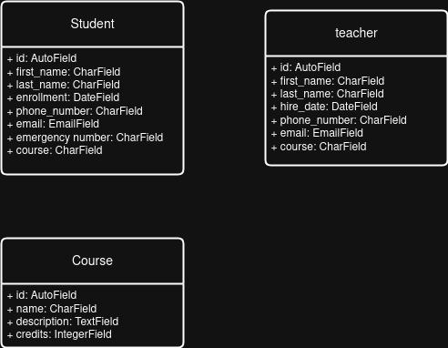
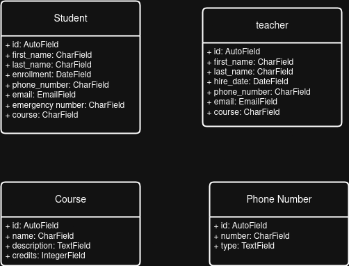
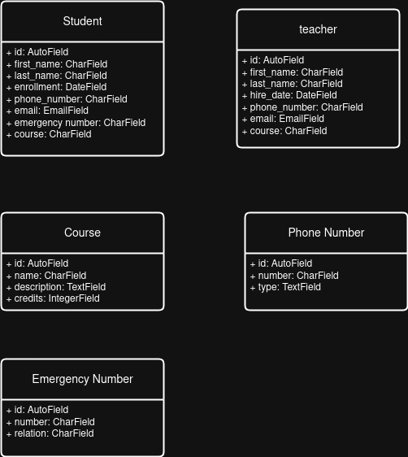
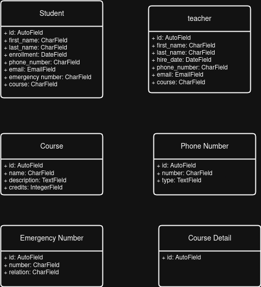
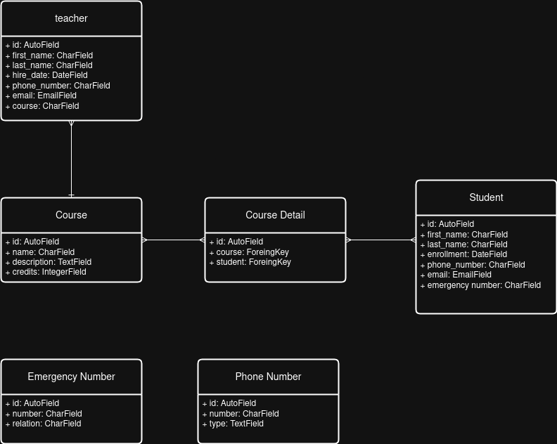
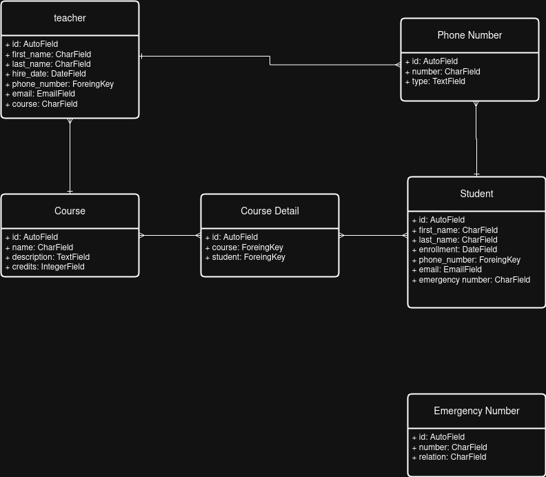
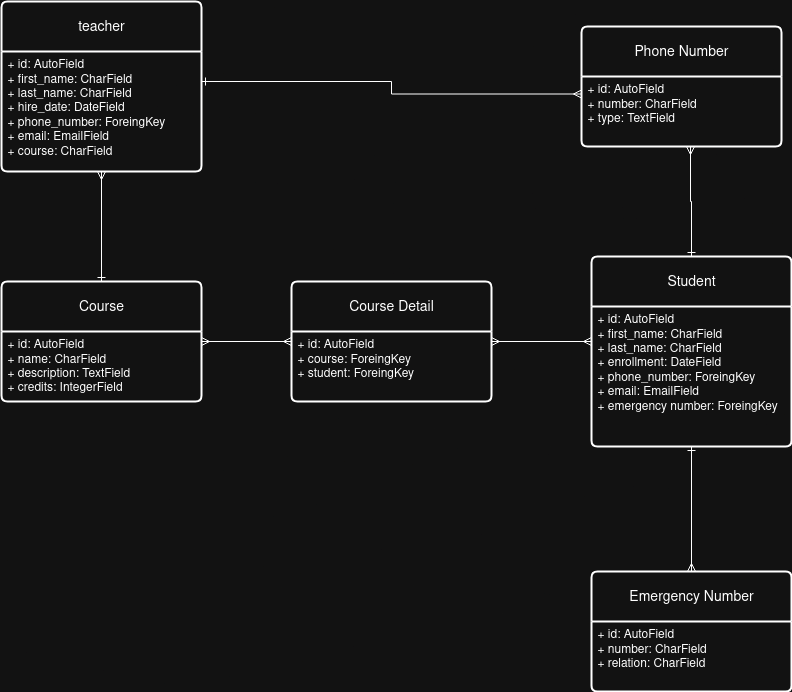

# Tareas_Progra_web
# Diagramas de las migraciones

## Creacion del modelo de estudiantes

## Creacion del modelo de maestros

## Creacion del modelo de cursos

## Creacion de la fila de curso en maestro y estudiante

## Creacion de la fila de id en maestro y estudiante

## Creacion del modelo de numero telefonico

## Creacion del modelo de numero de emergencia

## Creacion del modelo de detalles de los cursos para los estudiantes

## Creacion de las conecciones de los estudiantes con los detalles del curso y del curso con los detalles y los maestros

## Creacion de las conecciones de los estudiantes y maestros con el numero de telefono 

## Creacion de las conecciones de los estudiantes con el numero de emergencia

